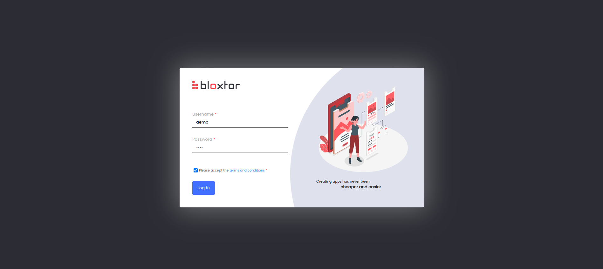
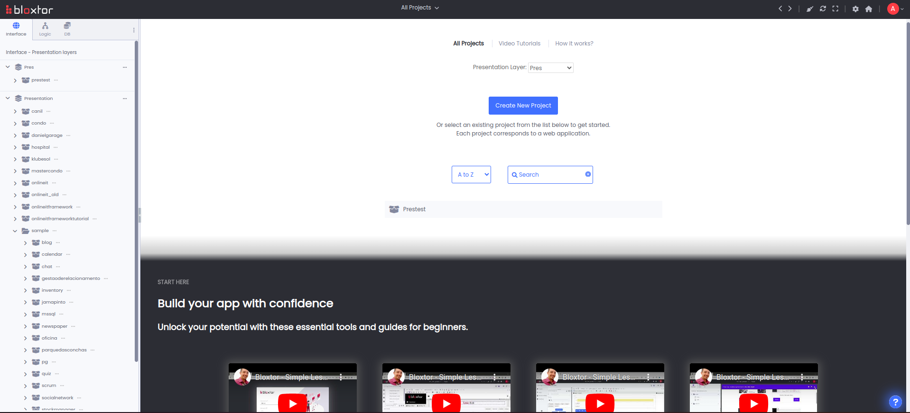
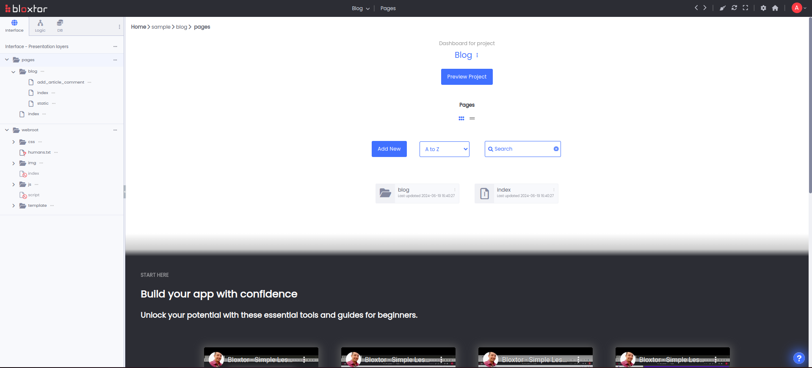
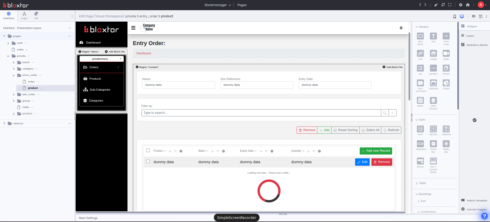
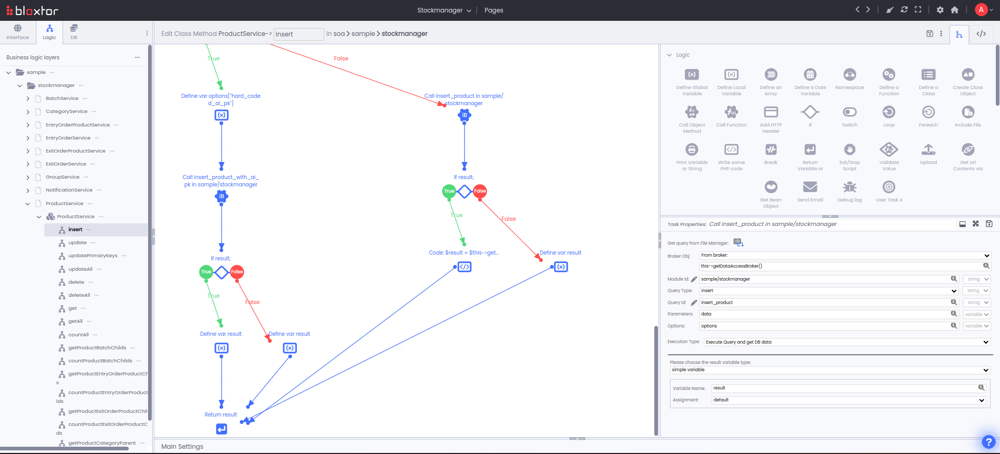
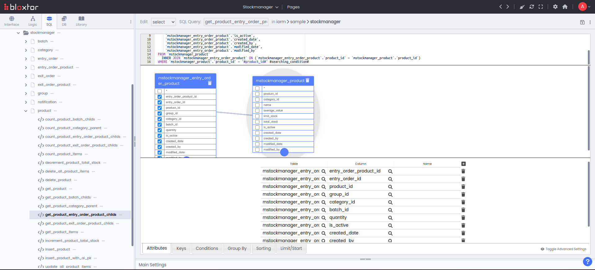
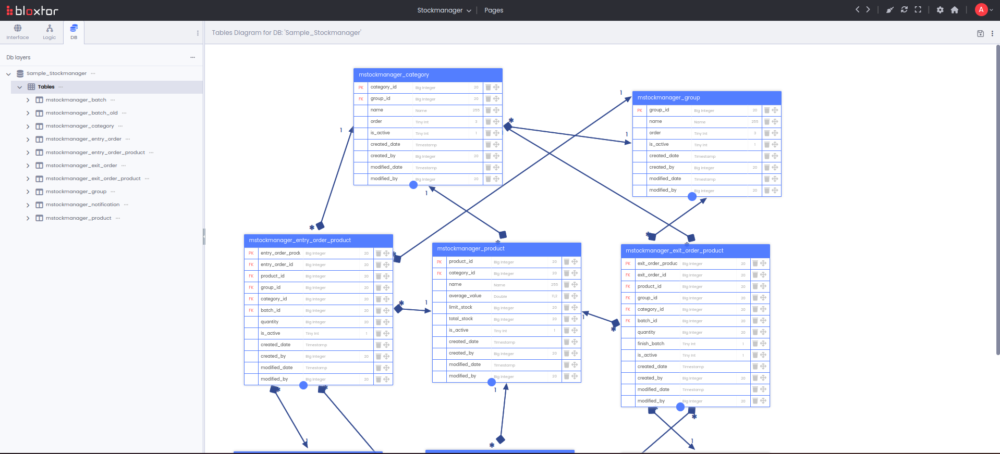

# Bloxtor framework

## What is Bloxtor

Bloxtor is a **professional and intelligent web-development framework designed for No-Coders, Low-Coders, and Coders alike**. It functions as a versatile code reader and converter, seamlessly transforming code into visual environments and visual components back into code. 
The concept is to provide a centralized AI-powered web development platform with multiple levels of Citizen Development, empowering both technical and non-technical developers to easily create any type of web application, while also giving programmers a robust tool they can rely on as their primary development resource.
Discover more about Bloxtor on our homepage: [https://www.bloxtor.com]

- All installations steps are in [INSTALL.md](./INSTALL.md).
- Explore the Framework: Start learning how to work with Bloxtor by following the steps in [LEARN.md](./LEARN.md).
- Please read our documentation [here](https://bloxtor.com/onlineitframeworktutorial/).
- Please watch our video tutorials [here](https://bloxtor.com/onlineitframeworktutorial/?block_id=video/simple).
- Please read the Bloxtor terms and conditions at [LICENSE.md](./LICENSE.md).
- Please review [TODOS.md](./TODOS.md) to see how you can contribute to improving Bloxtor, and refer to [CONTRIBUTING.md](./CONTRIBUTING.md) for instructions on submitting your contributions.
- Stay updated with the latest Bloxtor news by subscribing to our LinkedIn channel [here](https://www.linkedin.com/company/bloxtor/).

### Key Features

- **Faster Development**: With Bloxtor, developers can create applications 3x faster.
- **Open-Source Freedom**: Bloxtor is open-source and transparent, giving you full control and independence from third-party dependencies. Check our [LICENSE.md](./LICENSE.md) for more details.
- **Team Collaboration and Permissions**: Bloxtor supports development with multiple teams managing multiple projects and clients simultaneously, with customizable permissions and access controls, effectively solving Shadow IT issues.
- **Automatic Code Generation**: Let Bloxtor generate the code for you. Customize it visually or dive into the code directly whenever you wish.
- **Scalable Applications**: Every application built with Bloxtor is scalable, adheres to programming standards, and ensures stability and security, allowing developers to focus on business requirements.
- **Flexible Deployment**: Deploy your applications in monolithic or microservices architectures across one or multiple servers.
- **Extensibility**: Bloxtor’s framework is designed for extensions, allowing developers to expand its functionality to meet their specific needs.
- **Multiple Development Environments**: Developers have the flexibility to work in no-code, low-code, or traditional code environments. Choose the preferred workspace that suits your project needs.
- **Code Reverse Engineering**: Convert existing code into visual environments and vice versa, streamlining your development process.
- **Database Management**: Perform reverse engineering and management of databases with ease.
- **Drag & Drop Page Creation**: Design pages effortlessly using no-code, low-code, or code. 
- **Responsive Design**: Craft perfect designs that are fully optimized for web and mobile devices, bringing your website to life.
- **Promote Developer Rotativity**: Bloxtor is prepared for developer rotativity, ensuring you don't lose the code a developer was working on just because they left your company. Easily onboard new developers without disruption.

### History

Bloxtor emerged from the extensive professional experience of its creator, who identified a significant market gap for such a tool. Over many years, he developed and refined various solutions, which culminated in the creation of Bloxtor. The development process began during the creator’s free time while working in various companies, where Bloxtor's early iterations were also utilized. Although its market release was delayed due to its complexity, this allowed for the integration of cutting-edge features, drawing on the creator's professional expertise and the latest technological advancements.

### Mission and Vision

Our **mission** is to offer a comprehensive tool that centralizes the entire web application development process, from planning to maintenance, empowering all users to contribute to the development process. This includes creating UML diagrams, supporting low-code, no-code, and citizen development, and providing deployment systems, unit tests, ticket management, BPM, and CRM systems, all enhanced with artificial intelligence.
Our mission is to create a versatile framework that can be used in any scenario, whether remotely or locally, online or offline, by everyone – both tech-savvy and non-tech individuals. Our tool is designed for use by individuals and companies alike, across all departments, not just IT.
We believe that by creating a framework accessible to everyone - no-coders, low-coders, and coders - we will significantly advance the global web development and leave our mark on the world.

Our **vision** is to make web development faster, more automated, intelligent, and sustainable. We aim to make Bloxtor a go-to framework for no-code, low-code, and coding development projects, maintaining flexibility even with high levels of code abstraction.
The goal is to develop a framework that serves as the primary development resource for web applications across all company departments, not just IT. With AI assistance, developers can start by creating apps using natural language and then seamlessly transition to no-code, low-code, and eventually full-code programming as needed. This approach offers multiple levels of creation tailored to each developer's technical expertise, ensuring flexibility and scalability. By automatically addressing challenges like shadow IT, scalability, and security issues, the framework enables developers to focus on what truly matters—the client’s business requirements.
Our vision is to challenge the dominance of big companies in global web development. We dream of claiming a share of their pie by offering a free and transparent alternative to the world.

### Goals

- **Global Reach**: Spread Bloxtor worldwide and build vibrant communities around it, promoting growth within open-source and other target groups.
- **Sustainable Business**: Initially establish a sustainable business, improving and sharing Bloxtor within its communities.
- **Central Repository**: Provide a central repository for web development accessible to everyone.
- **Independent Growth:** See Bloxtor grow independently and become widely used by developers everywhere. 

### Screenshots:

### How to Contribute

We are excited to open-source Bloxtor and welcome new contributors with open arms. There are several ways to contribute:
- **Report Bugs**: Help us find and fix issues by reporting bugs in the *GitHub Issues section*.
- **Development**: Contribute code for new features or improvements. Check out our [CONTRIBUTING.md](./CONTRIBUTING.md) and [CODE_OF_CONDUCT.md](./CODE_OF_CONDUCT.md) to get started.
- **Documentation**: Improve existing documentation or write tutorials and examples to help new users.
- **Feedback**: Provide us with feedback on how we can improve Bloxtor.

. 

---

## Versions

### Version 1.2

This is the Bloxtor version for PHP 5.6 or higher (tested until PHP8.4).
What was fixed:
- Transformed framework to work in PHP 7.3, 7.4, 8.0, 8.2, 8.3 and 8.4;
- Errors fixed;

### Version 1.1

Bloxtor version for PHP 5.6 or higher (tested until PHP 7.2).
What was fixed:
- Transform framework to be more user-friendly;
- Was added tutorials (documentation and videos);
- Transform framework to work with multiple presentation layers;
- Errors fixed;

### Version 1.0
	
What was fixed:
- Was added new design to the framework;
- Errors fixed;

